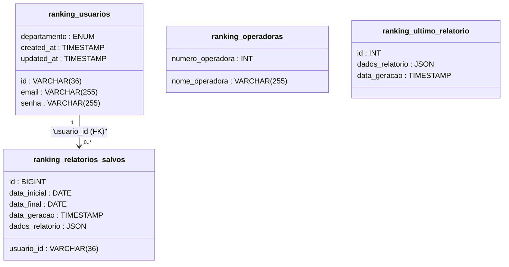

```mermaid
classDiagram
    class ranking_usuarios {
        id : VARCHAR(36)
        departamento : ENUM
        email : VARCHAR(255)
        senha : VARCHAR(255)
        created_at : TIMESTAMP
        updated_at : TIMESTAMP
    }
    class ranking_operadoras {
        numero_operadora : INT
        nome_operadora : VARCHAR(255)
    }
    class ranking_ultimo_relatorio {
        id : INT
        dados_relatorio : JSON
        data_geracao : TIMESTAMP
    }
    class ranking_relatorios_salvos {
        id : BIGINT
        usuario_id : VARCHAR(36)
        data_inicial : DATE
        data_final : DATE
        data_geracao : TIMESTAMP
        dados_relatorio : JSON
    }

    ranking_usuarios "1" --> "0..*" ranking_relatorios_salvos : "usuario_id (FK)"
```